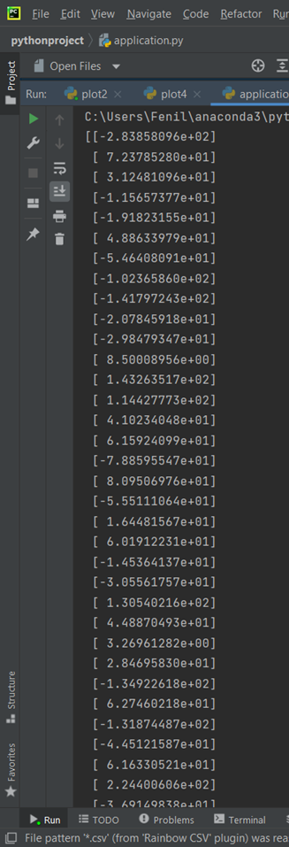
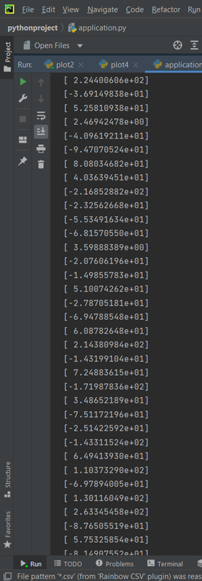
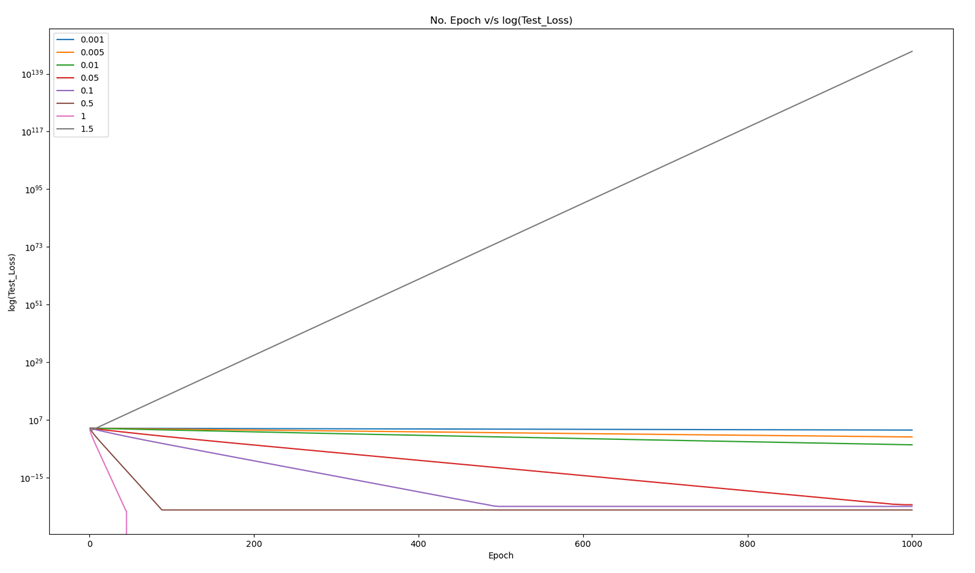

# Linear-Regression---ML

The predictions of Y Labels made by importing the linear_regression.py file and using it in application.py file are as follows. 
   
  

As per the requirement in the question, after trial and error, I found the following parameters to satisfy the given condition of Testing Loss to be less than 0.01. 

The corresponding Training Loss and Testing Loss is also reported in the image shown below which displays the output obtained after running the application.py file. 
 

By running a python script**, I obtained a relationship between the logarithm at base 10 of the Testing Loss and the Number of Epoch for few specific values of alpha (learning rate) as shown below. The legend in the graph displays the values of alpha corresponding to that color. 
 
**I have added the script I used to plot this data later in this pdf.

As we can see from the graph, for the given training and test dataset, we can get very small Testing loss (very close to zero) when alpha is 1. But a very high value of alpha will not converge to the minimum of the cost function and cause overshoot, which can be seen from the graph when alpha is 1.5. Therefore, it is advised to keep alpha very small to avoid overshooting which using gradient descent method. 
We can also observe that as we increase the number of epochs, and if the value is reasonable, the Testing Loss will keep on reducing and will approach close to zero. But hypothetically it will take epoch = infinity to reach absolute zero. As we keep on increasing the number of epochs, computational complexity also increases as we revisit the training data set more and more times. 
Therefore, we have to tradeoff between the value of alpha and number of epochs to get the desired value of Testing Loss. 
As Learning rate determines how quickly the model fits the problem, smaller learning rates (alpha) will require a high number of epochs to learn the model whereas high alpha will require relatively less numbers of epoch to learn the model. But high alpha can cause overshoot problems and end up in giving a model that provides poor output. 
Keeping in mind the requirements for the question (Testing Loss < 0.01), computational complexity increasing with the number of epochs and overshoot problem arising with increasing alpha value, I chose alpha = 0.02 and n_epoch = 500.
Note that another combination of alpha and n_epoch exists that gives lower Testing Loss, but the combination I chose is suffice for the problem under consideration and this gives a more of a general solution as low alpha and medium epoch is a desirable combination.  

